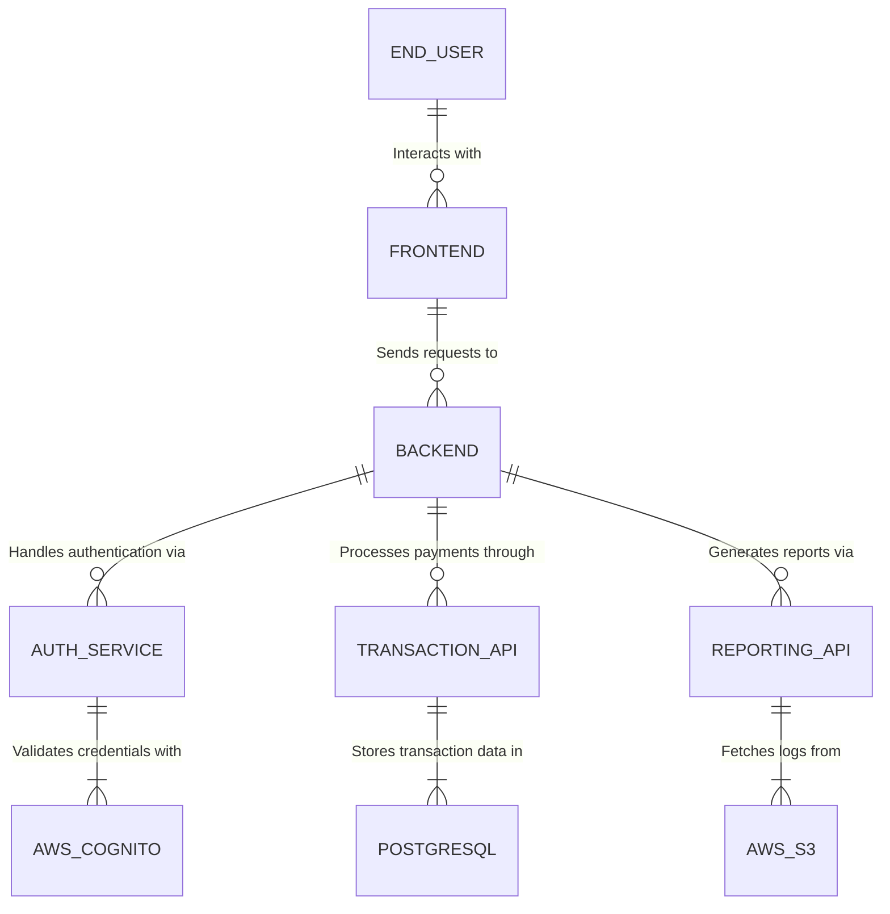

## Explanation

### Entities:
- **END-USER**: The application’s client (e.g., web or mobile user).
- **FRONTEND**: The React.js frontend.
- **BACKEND**: The FastAPI backend that handles core functionality.
- **AUTHENTICATION-SERVICE**: Handles user authentication.
- **TRANSACTION-API**: Manages payment processing.
- **REPORTING-API**: Generates transaction and usage reports.
- **AWS-COGNITO**: Provides authentication and token issuance.
- **POSTGRESQL**: Stores transactional and user data.
- **AWS-S3**: Holds logs for reporting and analytics.

### Relationships:
1. **END-USER** interacts with **FRONTEND**.
2. **FRONTEND** sends requests to **BACKEND**.
3. **BACKEND** communicates with:
   - **AUTHENTICATION-SERVICE**.
   - **TRANSACTION-API**.
   - **REPORTING-API**.
4. **AUTHENTICATION-SERVICE** validates credentials through **AWS-COGNITO**.
5. **TRANSACTION-API** stores data in **POSTGRESQL**.
6. **REPORTING-API** fetches logs from **AWS-S3**.
