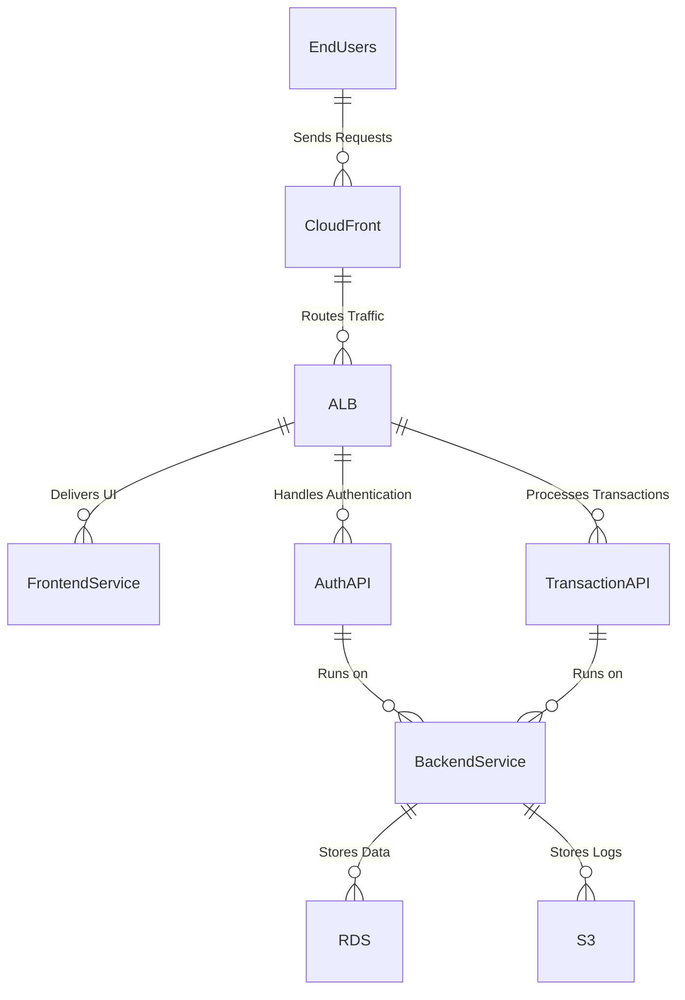

## Key Components

### 1. End Users
- **Description:** Customers using CloudVista's PayFast Wallet via web and mobile apps.
- **Communication:** HTTPS traffic to the cloud-based infrastructure.
### 2. CloudFront (CDN)
- **Purpose:** Distributes and caches content globally to reduce latency.
- **Security:**
  - Uses HTTPS for secure delivery.
  - Provides DDoS protection.
## 3. Application Load Balancer (ALB)
- **Purpose:** Distributes traffic to backend services.
- **Features:**
   - SSL termination for HTTPS.
   - Path-based routing to different services.
## 4. Frontend Service
- **Technology:** React application hosted on an S3 bucket with - public access through CloudFront.
- **Purpose:** Delivers the user interface for PayFast Wallet.
## 5. Backend APIs
- **Authentication API:**
   - Manages OAuth2-based authentication using AWS Cognito.
   - Issues secure tokens for API access.
- **Transaction API:**
  - Handles payments, fund transfers, and transaction queries.
  - Validates and processes requests using business rules.
## 6. Kubernetes Cluster (EKS)
- **Description:** Hosts containerized backend services (FastAPI microservices).
- **Features:**
  - Auto-scaling and load balancing.
  - Network segmentation for enhanced security.
## 7. PostgreSQL (RDS)
- **Purpose:** Relational database for storing user and transaction data.
- **Security:**
  - Encrypted at rest and in transit.
  - Backup and recovery configured.
## 8. AWS S3
- **Purpose:** Stores transaction logs and reporting data.
- **Security:**
  - Fine-grained bucket policies.
  - Encryption using AWS KMS.
